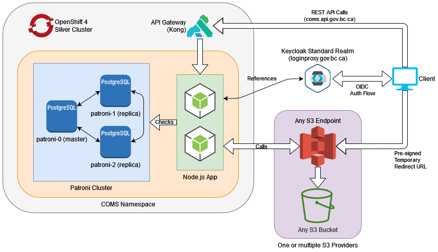

This page outlines the architecture and deployment features of the BC Gov Hosted COMS service. It is mainly intended for a technical audience, and for people who want to have a better understanding of how we have the service deployed.

**Note:** For more details of the COMS application itself and how it works, see the [Architecture](Architecture.md) overview.

## Table of Contents

- [Infrastructure](#infrastructure)
- [High Availability](#high-availability)
- [Network Connectivity](#network-connectivity)
- [Database connection Pooling](#database-connection-pooling)
- [Horizontal Autoscaling](#horizontal-autoscaling)

## Infrastructure

The BC Govt. Hosted COMS service runs on the OpenShift container ecosystem. The following diagram provides a general logical overview of main component relations. Main network traffic flows are shown in fat arrows, while secondary network traffic relations are shown with a simple black line.

**Figure 1 - The general infrastructure and network topology of the BC Govt. hosted COMS**

### High Availability

The COMS API and Database are all designed to be highly available within an OpenShift environment. The Database achieves high availability by leveraging [Patroni](https://patroni.readthedocs.io/en/latest/). COMS is designed to be a scalable and atomic microservice. On the OCP4 platform, there can be between 2 to 16 running replicas of the COMS microservice depending on service load. This allows the service to reliably handle a large variety of request volumes and scale resources appropriately.

### Network Connectivity

In general, all network traffic enters through the BC Govt. API Gateway. A specifically tailored Network Policy rule exists to allow only network traffic we expect to receive from the API Gateway. When a client connects to the COMS API, they will be going through OpenShift's router and load balancer before landing on the API gateway. That connection then gets forwarded to one of the COMS API pod replicas. Figure 1 represents the general network traffic direction with the outlined fat arrows. The direction of those arrows represents which component is initializing the TCP/IP connection.

COMS uses a database network pool to maintain persistent database connections. Pooling allows the service to avoid the overhead of repeated TCP/IP 3-way handshakes to start a connection. By reusing existing connections in a network pool, we can pipeline and improve network efficiency. We pool connections from COMS to Patroni within our architecture. The OpenShift load balancer follows general default Kubernetes scheduling behavior.

### Database connection Pooling

We introduced network pooling for Patroni connections to mitigate network traffic overhead. As our volume of traffic increased, it became expensive to create and destroy network connections for each transaction. While low volumes of traffic are capable of operating without any notable delay to the user, we started encountering issues when scaling up and improving total transaction flow within COMS.

By reusing connections whenever possible, we were able to avoid the TCP/IP 3-way handshake done on every new connection. Instead we could leverage existing connections to pipeline traffic and improve general efficiency. We observed up to an almost 3x performance increase in total transaction volume flow by switching to pooling.

### Horizontal Autoscaling

In order to make sure our application can horizontally scale (run many copies of itself), we had to ensure that all processes in the application are self-contained and atomic. Since we do not have any guarantees of which pod instance would be handling what task at any specific moment, the only thing we can do is to ensure that every unit of work is clearly defined and atomic so that we can prevent situations where there is deadlock, or double executions.

While implementing Horizontal Autoscaling is relatively simple by using a [Horizontal Pod Autoscaler](https://kubernetes.io/docs/tasks/run-application/horizontal-pod-autoscale/) construct in OpenShift, we can only take advantage of it if the application is able to handle the different types of lifecycles. Based on usage metrics such as CPU and memory load, the HPA can increase or decrease the number of replicas on the platform in order to meet the demand.

We found that in our testing, we were able to reliably scale up to around 17 pods before we began to crash out our Patroni database. While we haven't been able to reliably isolate the cause of this, we suspect that the underlying Postgres database can only handle up to 100 concurrent connections (and is thus ignoring Patroni's max connection limit of 500) or that the database containers are simply running out of memory before being able to handle more connections. As such, this is why we decided to cap our HPA to a maximum of 16 pods at this time.

Our current limiting factor for scaling higher is the ability for our database to support more connections for some reason or another. If we get into the situation where we need to scale past 16 pods, we will need to consider more managed solutions for pooling db connections such as [PgBouncer](https://www.pgbouncer.org/).
