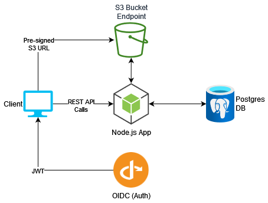
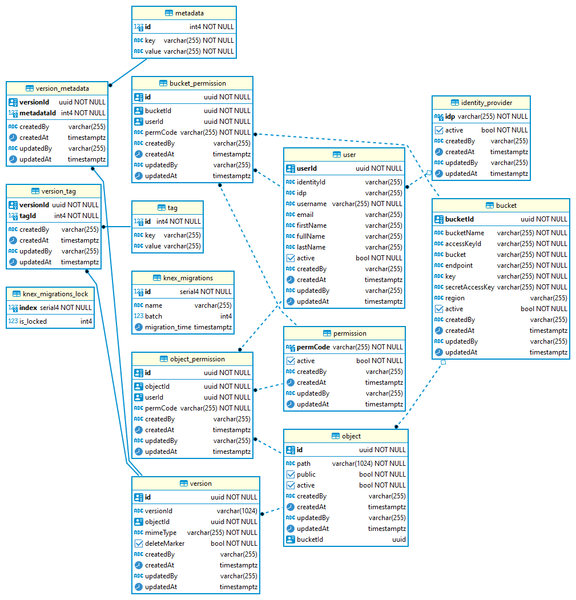
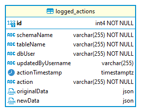

This page outlines the general architecture and design principles of COMS. It is mainly intended for a technical audience, and for people who want to have a better understanding of how the system works.

## Table of Contents

- [Infrastructure](#infrastructure)
- [Database Structure](#database-structure)
- [Code Design](#code-design)

## Infrastructure

**Figure 1 - The general infrastructure and network topology of COMS**

## Database Structure

The PostgreSQL database is written and handled via managed, code-first migrations. We generally store tables containing users, objects, buckets, permissions, and how they relate to each other. As COMS is a back-end microservice, lines of business can leverage COMS without being tied to a specific framework or language. The following figures depict the database schema structure as of April 2023 for the v0.4.0 release.

**Figure 3 - The public schema for a COMS database**

Database design focuses on simplicity and succinctness. It effectively tracks the user, the object, the bucket, the permissions, and how they relate to each other. We enforce foreign key integrity by invoking onUpdate and onDelete cascades in Postgres. This ensures that we do not have dangling references when entries are removed from the system. Metadata and tags are represented as many-to-many relationships to maximize reverse search speed.

**Figure 4 - The audit schema for a COMS database**

We use a generic audit schema table to track any update and delete operations done on the database. This table is only modified by database via table triggers, and is not normally accessible by the COMS application itself. This should meet most general security, tracking and auditing requirements.

## Code Design

COMS is a relatively small and compact microservice with a very focused approach to handling and managing objects. However, not all design choices are self-evident just from inspecting the codebase. The following section will cover some of the main reasons why the code was designed the way it is.

### Organization

The code structure in COMS follows a simple, layered structure following best practice recommendations from Express, Node, and ES6 coding styles. The application has the following discrete layers:

| Layer      | Purpose                                                                                      |
| ---------- | -------------------------------------------------------------------------------------------- |
| Controller | Contains controller express logic for determining what services to invoke and in what order  |
| DB         | Contains the direct database table model definitions and typical modification queries        |
| Middleware | Contains middleware functions for handling authentication, authorization and feature toggles |
| Routes     | Contains defined Express routes for defining the COMS API shape and invokes controllers      |
| Services   | Contains logic for interacting with either S3 or the Database for specific tasks             |
| Validators | Contains logic which examines and enforces incoming request shapes and patterns              |

Each layer is designed to focus on one specific aspect of business logic. Calls between layers are designed to be deliberate, scoped, and contained. This hopefully makes it easier to tell at a glance what each piece of code is doing and what it depends on. For example, the validation layer sits between the routes and controllers. It ensures that incoming network calls are properly formatted before proceeding with execution.

#### Middleware

COMS middleware focuses on ensuring that the appropriate business logic filters are applied as early as possible. Concerns such as feature toggles, authentication and authorization are handled here. Express executes middleware in the order of introduction. It will sequentially execute and then invoke the next callback as a part of its call stack. Because of this, we must ensure that the order we introduce and execute our middleware adhere to the following pattern:

1. Run the `require*` middleware functions first (these generally invole the middleware found in `featureToggle.js`)
2. Validation and structural cheks
3. Permission and authorization checks
4. Any remaining middleware hooks before invoking the controller
