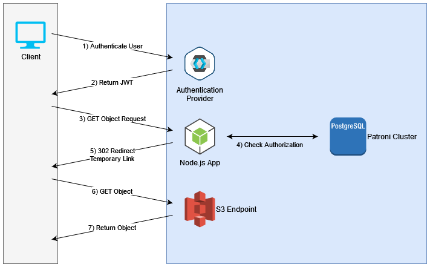

This page describes how to authenticate requests to the COMS API. The [Authentication Modes](Config.md#authentication-modes) must be enabled in the COMS configuration.

**Note:** The BC Gov Hosted COMS service only allows OIDC Authentication using JWT's issued by the [Pathfinder SSO `standard` keycloak realm](https://github.com/bcgov/sso-keycloak/wiki#standard-service)).

## OIDC Authentication

With [OIDC mode](Config.md#oidc-keycloak) enabled, requests to the COMS API can be authenticated using a **User ID token** (JWT) issued by an OIDC authentication realm. The JWT should be added in an Authorization header (type `Bearer` token).

COMS will only accept JWT's issued by one OIDC realm (specified in the COMS config). JWT's are typically issued to an application and saved to a user's browser when he/she signs-in to a website through the [Authorization Code Flow](https://openid.net/specs/openid-connect-core-1_0.html#CodeFlowAuth). Both the website (client app) and the instance of COMS must be [configured to use the same OIDC authentication realm](https://github.com/bcgov/common-object-management-service/blob/master/app/README.md#keycloak-variables) in order for the JWT to be valid.

When COMS receives the request, it will validate the JWT (by calling the OIDC realm's token endpoint). The JWT is a reliable way of verifying the the user's identity on which the COMS permission model is based.

The authentication when downloading an object also uses S3 pre-signed URLs:

### Authentication flow for readObject

Reference: [API Specification](https://coms.api.gov.bc.ca/api/v1/docs#tag/Object/operation/readObject) for more details.

A common use case for COMS is to download a specific object from object storage.
Depending on the `download` mode specified in the request, the COMS `readObject` endpoint will return one of the following:

1. The file directly from S3, by first doing a HTTP 302 redirect to a temporary pre-signed S3 object URL
2. The file streamed/proxied through COMS
3. The temporary pre-signed S3 object URL itself

COMS uses the redirect flow by default because it avoids unnecessary network hops. For significantly large object transactions, redirection also has the added benefit of maximizing COMS microservice availability. Since the large transaction does not pass through COMS, it is able to remain capable of handling other client requests.

**Figure 2 - The general network flow for a typical COMS object request**

## Basic Auth

If [Basic Auth Mode](Config.md#basic-auth) is enabled in your COMS instance, requests to the COMS API can be authenticated using an HTTP Authorization header (type `Basic`) containing the username and password configured in COMS.

This mode offers more direct access for a 'service account' authorized in the scope of the application rather than for a specific user and by-passes the COMS object/bucket permission model.

Basic Auth mode is not available on the BC Gov hosted COMS service.

## Unauthenticated Mode

[Unauthenticated Mode](Config.md#unauthenticated-auth) configuration is generally recommended when you expect to run COMS in a highly secured network environment and do not have concerns about access control to objects as you have another application handling that already.
