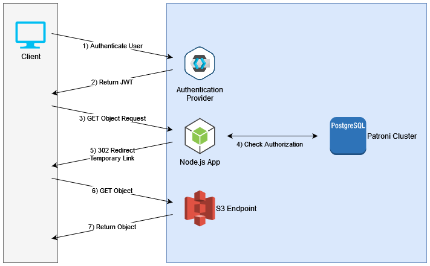

This page describes how to authenticate requests to the COMS API. The [Authentication Modes](Config.md#authentication-modes) must be enabled in the COMS configuration.

!!! Note
    The BC Government Hosted COMS service only allows [OIDC Authentication](#oidc-authentication) using JWTs issued by the [Pathfinder SSO `standard` Keycloak realm](https://developer.gov.bc.ca/docs/default/component/css-docs/Useful-References/#standard-realm), as well as [S3 Service Account Authentication](#s3-service-account).

## OIDC Authentication

With [OIDC mode](Config.md#oidc-keycloak) enabled, requests to the COMS API can be authenticated using a **User ID token** (JWT) issued by an OIDC authentication realm. The JWT should be included in the request as part of the `Authorization` header (type `Bearer` token).

COMS will only accept JWTs issued by one OIDC realm (specified in the COMS config). JWT's are typically issued to an application and saved to a user's browser when he/she signs-in to a website through the [Authorization Code Flow](https://openid.net/specs/openid-connect-core-1_0.html#CodeFlowAuth). Both the website (client app) and the instance of COMS must be [configured to use the same OIDC authentication realm](https://github.com/bcgov/common-object-management-service/blob/master/app/README.md#keycloak-variables) in order for the JWT to be valid.

When COMS receives the request, it will validate the JWT (by calling the OIDC realm's token endpoint). The JWT is a reliable way of verifying the the user's identity on which the COMS permission model is based.

The authentication when downloading an object also uses S3 pre-signed URLs:

### Authentication flow for readObject

!!! info
    Please see the [COMS OpenAPI Specification](https://coms.api.gov.bc.ca/api/v1/docs#tag/Object/operation/readObject) for more details.

A common use case for COMS is to download a specific object from object storage.
Depending on the `download` mode specified in the request, the COMS `readObject` endpoint will return one of the following:

1. The file directly from S3, by first doing a HTTP 302 redirect to a temporary pre-signed S3 object URL
2. The file streamed/proxied through COMS
3. The temporary pre-signed S3 object URL itself

COMS uses the redirect flow by default because it avoids unnecessary network hops. For significantly large object transactions, redirection also has the added benefit of maximizing COMS microservice availability. Since the large transaction does not pass through COMS, it is able to remain capable of handling other client requests.

**Figure 2 - The general network flow for a typical COMS object request**

## S3 Service Account

If `s3AccessMode` is enabled in the configuration, automated systems or services can securely interact with the COMS environment using object-storage credentials for authentication and authorization scoped to a particular bucket.

The credentials must match that of the object or COMS bucket's underlying object storage bucket, and are scoped to all COMS buckets that share the same such bucket.

### Credentials

Object storage bucket credentials are to be provided through the following HTTP headers:

* A basic authorization header
  * **Username:** the access key ID (or username) of the object storage user account; e.g. `energy_user_1`
  * **Password:** the secret access key (or password) of the object storage user account; e.g. `f6jGUSrmd9gdQg6`
* 2 additional headers:
  * **`x-amz-bucket`:** the name (or ID) of the object storage bucket; e.g. `yxwgj`
  * **`x-amz-endpoint`:** the object storage service endpoint; e.g. `https://nrs.objectstore.gov.bc.ca`

The credentials must match the ones previously provided to COMS when the bucket was created or updated. Attempting to use a different set of credentials – even if they valid for the given object storage bucket – will result in an error.

### Security Considerations

#### Store Credentials Securely

Ensure the access key ID and secret access key are stored securely, such as in environment variables or a secure credential vault, to prevent unauthorized access.

#### Use HTTPS

Make sure that all API requests are made over HTTPS to protect sensitive data during transmission.

## Global Basic Auth

If [Basic Auth Mode](Config.md#basic) is enabled in your COMS instance, requests to the COMS API can be authenticated using an HTTP Basic Authorization header containing the username and password configured in COMS.

This mode offers more direct access for a 'service account' authorized in the scope of the application rather than for a specific user and by-passes the COMS object/bucket permission model.

Global Basic Auth is not available on the [hosted service](Hosted-Service-Onboarding.md).

## Unauthenticated Mode

[Unauthenticated Mode](Config.md#unauthenticated) configuration is generally recommended when you expect to run COMS in a highly secured network environment, and do not have concerns about access control to objects as you have another application handling that already.
