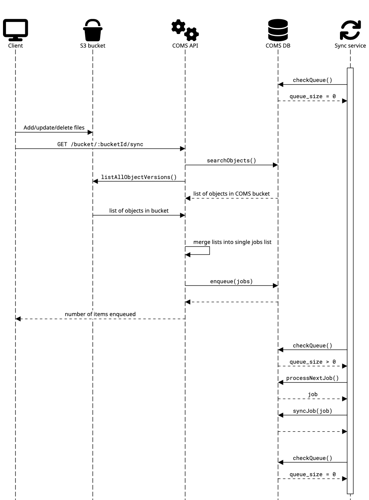
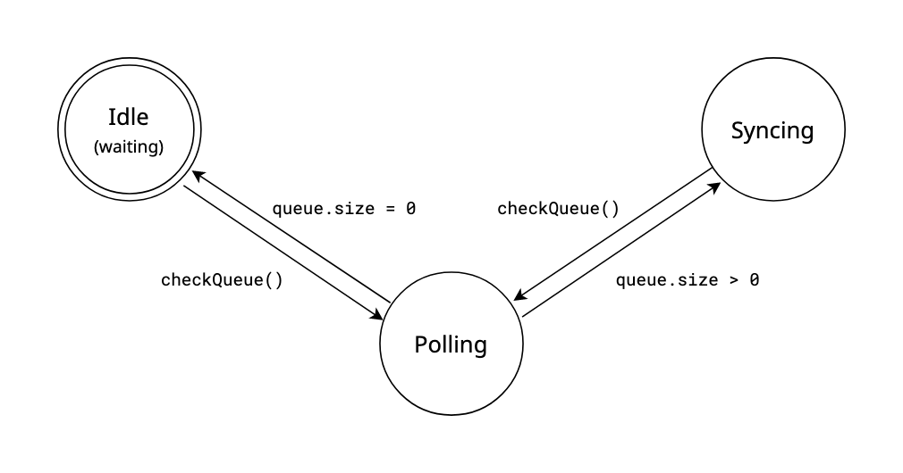

It is possible to directly modify the contents of a COMS-managed S3 bucket without going through COMS itself, as long as the user has the correct S3 bucket credentials.

However, as there is no mechanism for S3 to directly notify COMS of any changes, this can lead to a discrepancy between what's actually in the S3 bucket and what COMS thinks is in the bucket.

To avoid this, COMS can be told to **synchronize** a bucket, where it looks at a S3 bucket it manages and updates the entries in its database, matching what's actually in the bucket.

## The Synchronization process

Clients can trigger the sync process through a [set of dedicated API endpoints](https://coms.api.gov.bc.ca/api/v1/docs#tag/Sync).

When these endpoints are called, COMS checks both the S3 bucket and its database for a list of objects in the bucket, merges them into a single list without duplicates, and enqueues each resulting object (or **job**) into a shared queue in the COMS database, before returning the number of objects enqueued.

The actual synchronization is handled by a separate sync service, which polls the database queue for new jobs every 10 seconds. Once a job is picked up, it compares the corresponding object's state in both S3 and COMS; in particular, it looks at whether it exists in either S3 or COMS (that is, whether it's a new or deleted file), as well as its tags and metadata, and updates the database accordingly.

 
**Figure 1 - an illustration of the sync process**

## The `queueManager` service

The actual sync work is performed by the `queueManager` (labeled "Sync service" in the sequence diagram above), which is on a thread separate from the COMS API.

Every 10 seconds, it polls the queue, which is implemented as a database table named `object_queue`. If the queue is empty, it goes back to waiting for another ten seconds.

If the queue is not empty, it grabs a job from it, and performs the sync process on the associated file. Once it completes that process, it checks the queue for another job to process. If the queue is empty, it goes back to waiting for another 10 seconds before polling the queue again.

 
**Figure 2 - an illustration of queueManager's possible states, as it polls the queue and performs sync jobs.**
